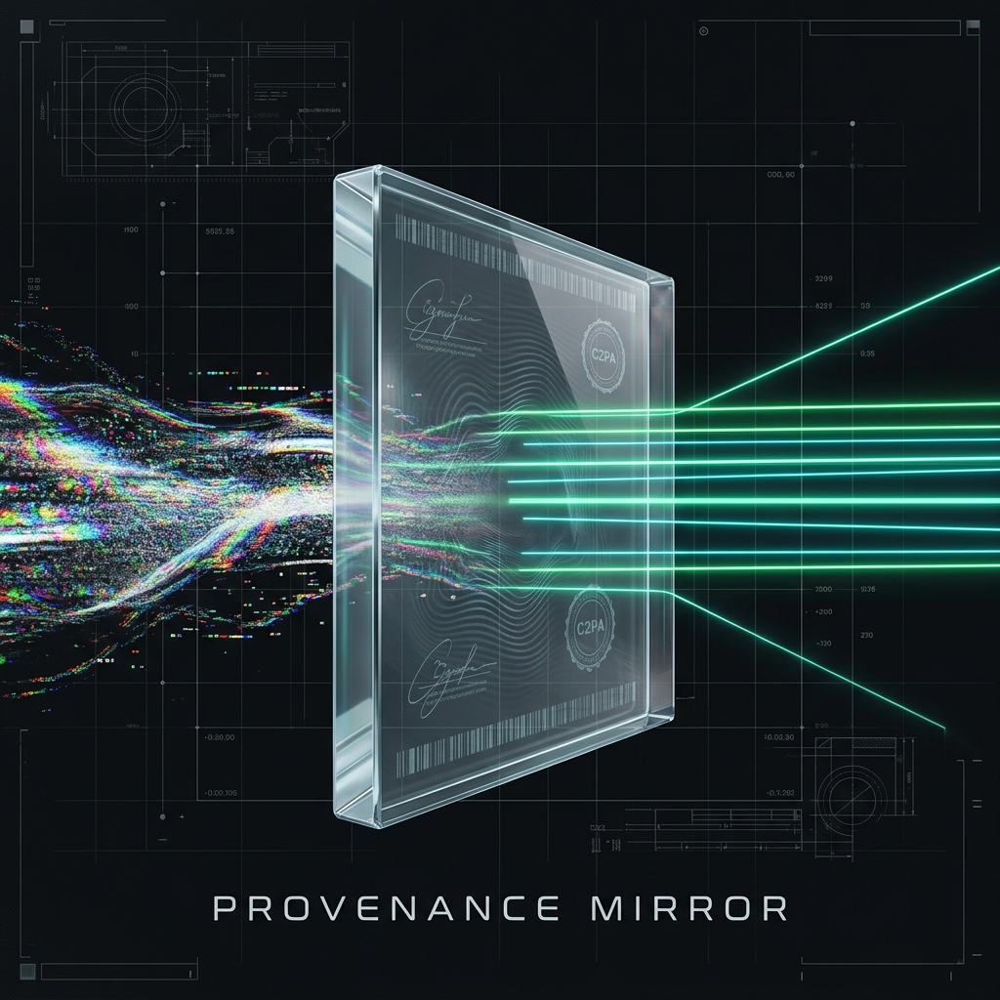

# 🔎 Provenance Mirror



**A content-authenticity *verifier* — not a deepfake *detector*.**
Sister tool to [Measurement Mirror](https://github.com/bhyi4/measure-mirror); same DNA, different domain.

> Zero training · Deterministic · Zero dependencies (Python 3.10+ stdlib only).

**[📖 Full Signal Guide →](docs/GUIDE.md)** · [한국어 README](README_KO.md)

---

## The core distinction

A **detector** looks at pixels and guesses "fake". That is a learned classifier
locked in an arms race — every detector trains the next generator to evade it.

A **verifier** checks deterministic **provenance & integrity signals** — signatures,
declared origin, container integrity. Cryptography and structure, not guessing.
Signatures can't be wished away by a better GAN.

Provenance Mirror is a verifier. Its most important output is the one detectors
refuse to give: **"I don't know."**

| Verdict | Meaning |
|---|---|
| 🟢 `AUTHENTIC-SIGNED` | A provenance manifest is present (C2PA / Content Credentials) |
| 🟠 `SYNTHETIC` | An AI-origin signal is present (generator metadata or declared assertion) |
| 🔴 `TAMPERED` | Integrity broken, or identical bytes re-sealed under a different origin |
| 🟡 `CONFLICTING` | Authentic and synthetic signals disagree — investigate |
| ⚪ `UNVERIFIED` | **No usable signal. UNKNOWN — this is NOT evidence of fakery.** |

That last row is the whole point: an unsigned real photo is `UNVERIFIED`, never
"fake". Refusing to brand the innocent is the value a detector can't offer.

---

## Five design principles (inherited from measure-mirror)

1. **Verifier, not detector** — never claim "fake" from pixels; check signals.
2. **Two-sided** — "no signal" = UNVERIFIED, not a fakery accusation.
3. **Honest about uncertainty** — the default verdict is `UNVERIFIED`.
4. **Sealed ledger** — every verdict is SHA-256 chain-hashed (tamper-evident).
5. **Input-driven** — only the signals actually present in the file are read.

---

## Signals

| # | Signal | Points to | What it reads |
|---|---|---|---|
| ① | `c2pa_manifest` | AUTHENTIC / SYNTHETIC | C2PA / Content Credentials manifest (AI-assertion flips it) |
| ② | `generator_meta` | SYNTHETIC | Known AI-generator fingerprint in metadata (Midjourney, SD, DALL·E…) |
| ③ | `ai_watermark` | SYNTHETIC | Declared AI watermark / training-media assertion |
| ④ | `tamper_anchor` | TAMPERED | Same bytes previously sealed under a *different* origin (re-attribution) |
| ⑤ | `format_integrity` | TAMPERED | Container structure intact? double-compression / splice hint |

---

## Usage

```bash
# Verify a file's provenance/integrity
python -m provmirror.pm verify photo.jpg

# Declare an origin to enable ④ re-attribution detection
python -m provmirror.pm verify photo.jpg --origin reuters.com

# Emit an embeddable badge
python -m provmirror.pm verify photo.jpg --badge markdown
```

```python
from provmirror import pm

res = pm.verify("photo.jpg", ledger_path="pm_ledger.jsonl", origin="reuters.com")
print(res["verdict"])          # e.g. "UNVERIFIED"
pm.report(res)                 # full signal breakdown
print(pm.badge(res))           # shields.io badge markdown
```

---

## Leak tracing (`provmirror.tracing`)

We cannot stop a leak (preventing read = DRM = a losing game). We **can** prove
a leak happened and trace *which recipient's copy* leaked — the verifier
philosophy applied to distribution.

```python
from provmirror import tracing as tr

# Distribute one document to three people — each copy carries an invisible,
# per-recipient zero-width-character fingerprint. Visually identical.
for who in ["jebi", "sonnet", "ext-partner-07"]:
    out = tr.distribute(DOC, recipient=who, doc_id="q3-report",
                        ledger_path="pm_ledger.jsonl")
    send(who, out["marked_text"])

# Months later a copy surfaces on a forum → who leaked it?
tr.trace(leaked_text, ledger_path="pm_ledger.jsonl")
# → CONFIRMED: recipient='jebi' (mark decodes AND sealed bytes match)
```

| Verdict | Meaning |
|---|---|
| `CONFIRMED` | Mark decodes to a recipient AND exact bytes match a sealed record |
| `FINGERPRINT-ONLY` | Mark names the recipient, but the copy was edited afterwards |
| `HASH-MATCH` | No readable mark, but exact distributed bytes match a sealed copy |
| `DOC-KNOWN` | Document recognized, recipient unknown (mark was stripped/re-typed) |
| `UNTRACEABLE` | No mark, no matching record |

**How it works:** recipient ids are encoded as a bit-string of zero-width
characters (U+200B/U+200C, framed by U+200D), hidden between words. Invisible
in every renderer, survives copy/paste, decoded back to the recipient id.

**Honest limits (this raises the cost of a clean leak; it is not unbreakable):**
- Survives copy/paste; does **not** survive re-typing, OCR, screenshots, or a
  deliberate zero-width strip step. A knowledgeable leaker can launder it →
  `DOC-KNOWN` (we still prove *which document*, just not who).
- Attribution names a *copy*, not a person — a stolen copy can frame its owner.
  Treat as evidence, not verdict.
- Obfuscation, not encryption — marks are visible to anyone scanning for
  zero-width bytes.

## Honest limitations (this is a PoC frame, not a product)

The **frame** is real and tested; the **heavy crypto/ML signals are stubs**:

- **C2PA signature chain is NOT cryptographically verified** — ① detects a
  manifest's *presence* by byte-scan; validating the signing chain needs the
  `c2pa` library (documented TODO).
- **Steganographic watermarks (SynthID etc.) are NOT read** — they're private to
  the vendor detector; ③ only sees *declared* markers.
- **No pixel/frequency analysis** — by design. That's the detector arms race we
  deliberately avoid. If a learned classifier is ever added, it goes *inside* the
  verifier as one audited signal — never as the whole verdict.

What's solid today: the verdict logic, the honesty guarantee (`UNVERIFIED` ≠
fake), the re-attribution tamper-anchor, and the sealed chain-hash ledger —
all zero-dependency and deterministic. 22 tests, all passing.

---

## Roadmap (if it earns its keep)

1. Real C2PA signature-chain verification (`c2pa` optional dep)
2. Proper EXIF/XMP parsing for metadata-consistency contradictions
3. MCP server (mirror measure-mirror's pattern) so an agent can call `pm_verify`
4. Certificate utility + provenance badge for embedding

Built as a sister to measure-mirror, under the same discipline:
**measure what you can prove, say "unknown" about the rest.**
